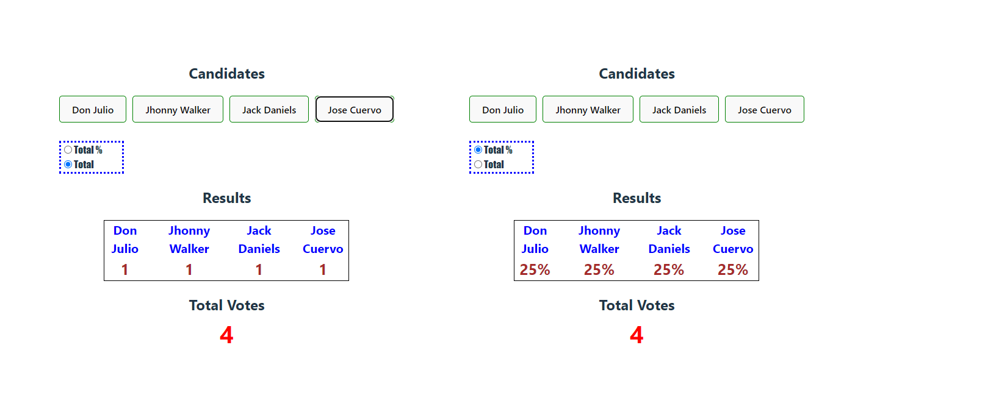

# Make It Real - All about context

## This is a solution to the _Context_ project of the Make It Real course.

## The challenge

All About Context

## Vercel page

Production: https://todo-sobre-contexto.vercel.app/

## Screenshot

## Our process

### Built with

- Semantic markup using vscode editor
- React code using vite in vs code
- CSS properties in a stylesheet file
- React Router library
- context from react

## What I learned

I practice html, css, react, context

## Author

## Acknowledgments

Thanks to Make it Real to show me a path to become a better programmer
